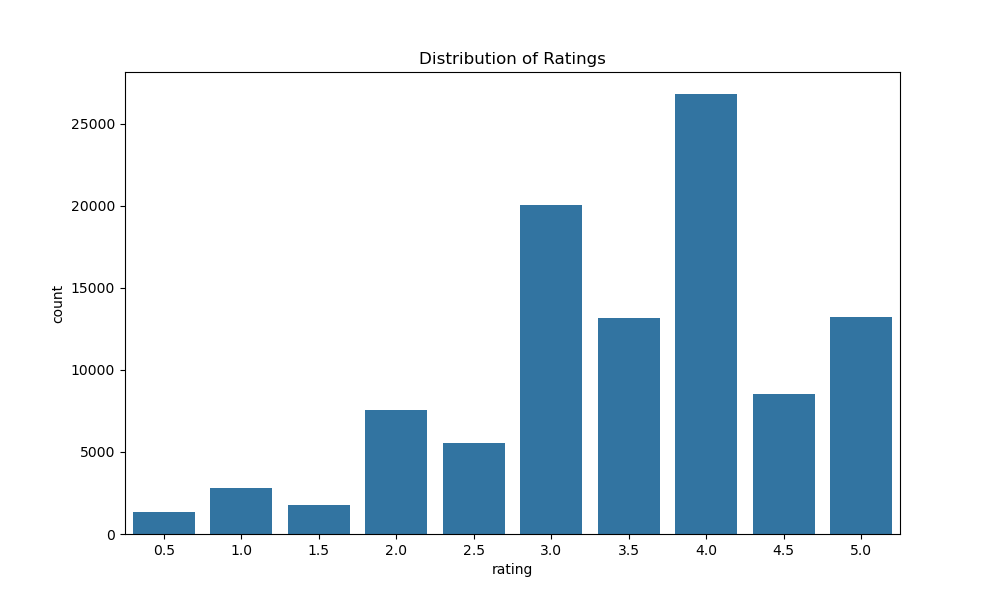
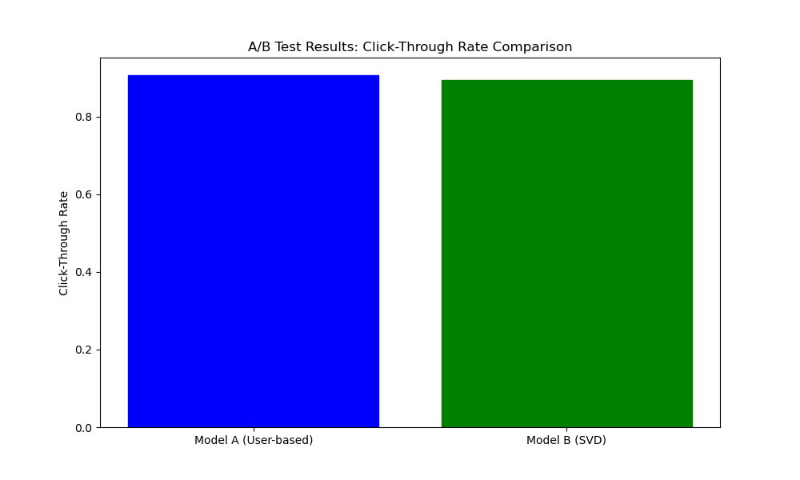

# MovieLens Recommender System

A comprehensive recommendation system built on the MovieLens dataset that demonstrates personalization models, A/B testing, cloud deployment, and big data processing capabilities.



## Project Overview

This project implements a movie recommendation system with multiple recommendation approaches, an A/B testing framework for algorithm comparison, big data simulation using Polars, and deployment via Flask API and AWS SageMaker.

### Key Features

- **Multiple recommendation models** - Collaborative filtering (user-based & item-based), matrix factorization (SVD), and content-based filtering
- **Statistical A/B testing framework** - Compare algorithms with click-through rate simulation and significance testing
- **Large-scale data handling** - Process and analyze synthetic data of 500,000+ interactions using Polars for high performance
- **API for serving recommendations** - Flask-based web service for real-time predictions
- **Cloud deployment simulation** - AWS SageMaker deployment framework

## Directory Structure

```
movielens-recommender/
│
├── ml-latest-small/           # MovieLens dataset
├── requirements.txt           # Project dependencies
├── app.py                     # Flask API for serving recommendations
├── sagemaker_deployment.py    # AWS deployment simulation
│
├── notebooks/                 # Jupyter notebooks with analysis
│   └── recommendation_system.ipynb
│
├── model/                     # Trained models
│   ├── user_based_model.pkl
│   ├── item_based_model.pkl
│   ├── svd_model.pkl
│   └── content_sim_matrix.pkl
│
├── data/                      # Data files
│   └── synthetic_interactions.csv
│
└── static/                    # Static assets
    ├── rating_distribution.png
    ├── top_movies.png
    └── ab_test_results.png
```

## Installation

1. Clone the repository:
```bash
git clone https://github.com/yourusername/movielens-recommender.git
cd movielens-recommender
```

2. Create a virtual environment:
```bash
python -m venv venv
source venv/bin/activate  # On Windows: venv\Scripts\activate
```

3. Install the dependencies:
```bash
pip install -r requirements.txt
```

4. Download the MovieLens dataset (if not already present):
```bash
python -c "
import os
import urllib.request
import zipfile
if not os.path.exists('ml-latest-small'):
    print('Downloading MovieLens dataset...')
    urllib.request.urlretrieve('https://files.grouplens.org/datasets/movielens/ml-latest-small.zip', 'ml-latest-small.zip')
    with zipfile.ZipFile('ml-latest-small.zip', 'r') as zip_ref:
        zip_ref.extractall('.')
    print('Download complete!')
"
```

## Usage

### Running the Recommendation System

1. Explore the full analysis in the Jupyter notebook:
```bash
jupyter notebook notebooks/recommendation_system.ipynb
```

2. Start the Flask API for recommendations:
```bash
python app.py
```

3. Access API endpoints:
   - Prediction endpoint: `POST /predict` with JSON payload `{"userId": 1, "movieId": 1, "model": "svd"}`
   - Recommendations endpoint: `GET /recommend/user?userId=1`

### AWS SageMaker Deployment Simulation

Run the deployment simulation script:
```bash
python sagemaker_deployment.py
```

## Models Implementation

### Recommendation Approaches

1. **User-Based Collaborative Filtering**
   - Finds users with similar taste and recommends what they liked
   - RMSE: 0.9727, MAE: 0.7511

2. **Item-Based Collaborative Filtering**
   - Recommends items similar to those the user liked
   - RMSE: 0.9652, MAE: 0.7491

3. **Matrix Factorization (SVD)**
   - Discovers latent factors that explain ratings
   - RMSE: 0.8736, MAE: 0.6713

4. **Content-Based Filtering**
   - Recommends movies with similar genres using TF-IDF and cosine similarity

### A/B Testing Framework

The system includes a statistical A/B testing framework that:
- Simulates user interactions with different recommendation algorithms
- Calculates Click-Through Rate (CTR) for each model
- Performs statistical significance testing
- Determines the winning algorithm with confidence levels

Results from testing User-Based CF vs. SVD:
- CTR Model A (User-based): 0.8936
- CTR Model B (SVD): 0.9060
- Lift: 1.39%
- p-value: 0.0389 (Statistically Significant)
- Winner: Model B (SVD)



### Big Data Processing

The project demonstrates big data capabilities using Polars:
- Generating synthetic data with 500,000+ interactions
- Efficient aggregations and filtering
- Fast joins and transformations
- Memory-efficient batch processing for predictions
- User-item matrix creation and similarity calculations

Performance metrics:
- Data generation: 2.48 seconds for 500,000 interactions
- Aggregation computation: 0.01 seconds
- Join and filter operations: 0.02 seconds
- User-item matrix creation: 0.12 seconds
- Item similarity calculation: 0.14 seconds
- Batch prediction: 0.06 seconds

## Future Improvements

1. **Advanced Models**
   - Implement deep learning-based recommendation approaches
   - Add sequential and temporal recommendations
   - Incorporate contextual information

2. **Enhanced A/B Testing**
   - Multi-armed bandit for continuous optimization
   - More sophisticated engagement metrics
   - User segment analysis

3. **Production Readiness**
   - Monitoring and logging infrastructure
   - CI/CD pipeline for model updates
   - Caching layer for popular recommendations

## Tech Stack

- **Data Processing**: Pandas, NumPy, Polars
- **Machine Learning**: Surprise, Scikit-learn
- **Visualization**: Matplotlib, Seaborn
- **API & Deployment**: Flask, AWS SageMaker
- **Statistical Analysis**: SciPy

## License

This project uses the [MovieLens dataset](https://grouplens.org/datasets/movielens/) which is available for non-commercial use.

## Acknowledgments

- [GroupLens Research](https://grouplens.org/) for the MovieLens dataset
- [Surprise](https://surpriselib.com/) library for collaborative filtering algorithms
- [Polars](https://pola.rs/) for efficient data processing
